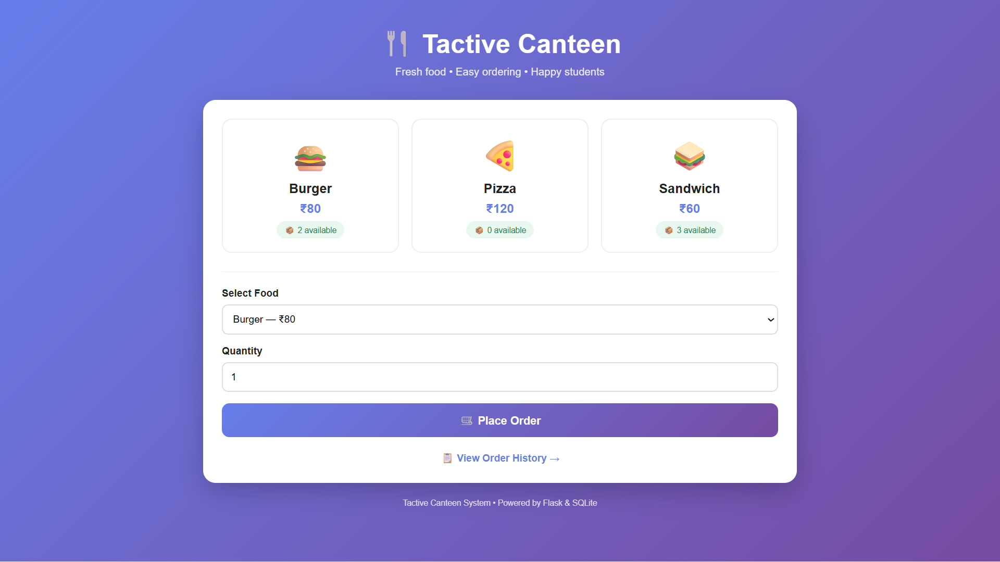
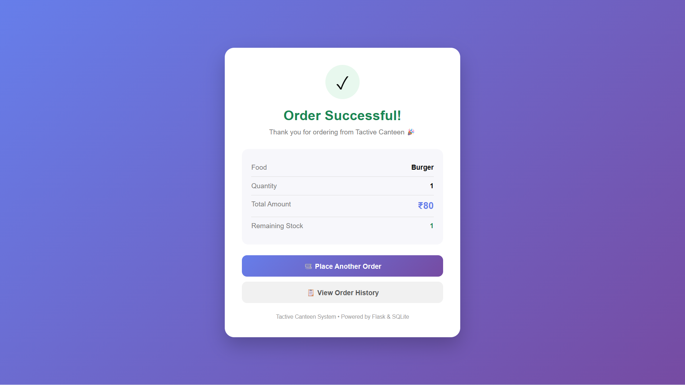
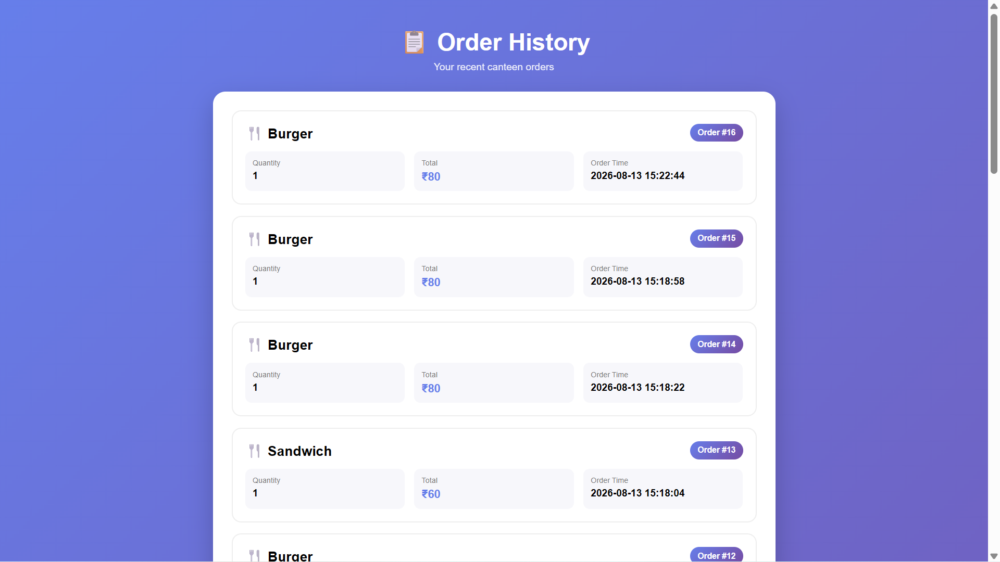
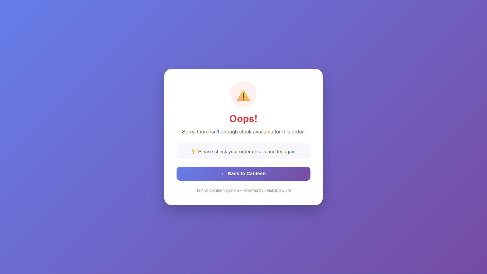
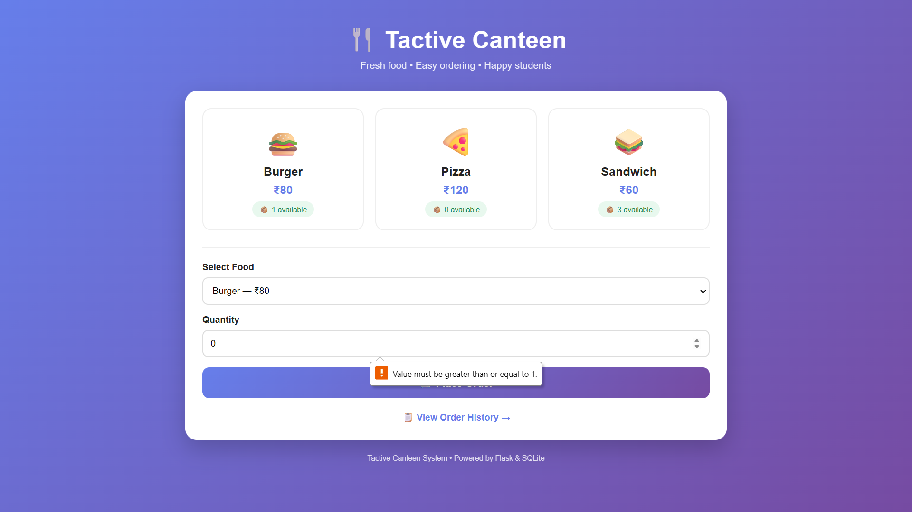
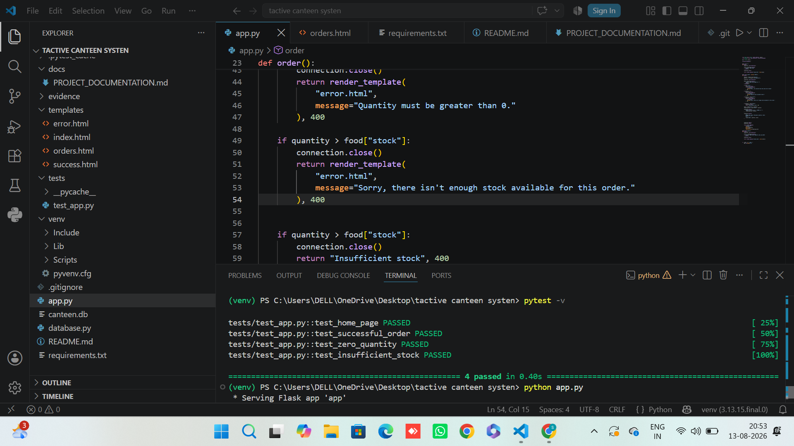

# Tactive Canteen System

A simple web-based canteen ordering system developed using Flask and SQLite. The system allows users to view available food items, place orders, automatically update stock, and view previous order history.

## Features

- View available food items
- Display food prices and stock
- Select food and quantity
- Place an order
- Calculate total order amount
- Automatically reduce food stock after an order
- Prevent orders when stock is insufficient
- Prevent zero or invalid quantities
- Store orders in SQLite database
- View order history
- Automated testing using pytest

## Technologies Used

- Python
- Flask
- SQLite
- HTML
- CSS
- Jinja2
- Pytest

## Project Structure

TACTIVE CANTEEN SYSTEM/
│
├── app.py
├── database.py
├── requirements.txt
├── README.md
├── .gitignore
│
├── templates/
│   ├── index.html
│   ├── orders.html
│   ├── success.html
│   └── error.html
│
├── tests/
│   └── test_app.py
│
├── docs/
│
└── evidence/

## Screenshots

### Home Page

### Successful Order

### Order History

### Insufficient Stock

### Zero Quantity Validation

### Test Results
